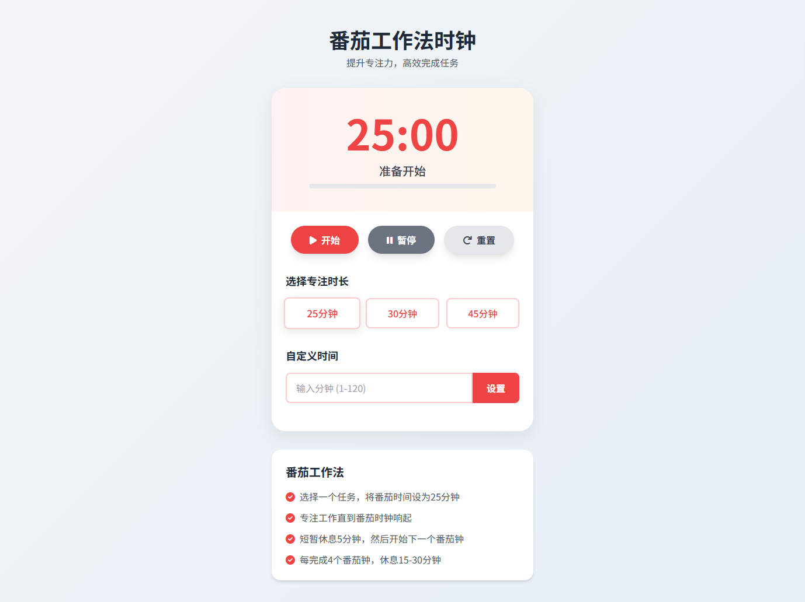

# PomoFocus - 优雅的番茄工作法计时器

 
## 项目概述

PomoFocus 是一个精心设计的番茄工作法计时器网页应用，帮助用户提高专注力和工作效率。该项目实现了番茄工作法的核心功能，采用现代化前端技术栈构建，具有响应式设计和流畅的用户体验。

**在线体验**：https://your-username.github.io/PomoFocus/ <!-- 替换为你的实际部署链接 -->

## 技术栈

- **前端框架**：原生 HTML/CSS/JavaScript
- **UI 框架**：[Tailwind CSS](https://tailwindcss.com/) v3.3+
- **图标库**：[Font Awesome](https://fontawesome.com/) v6
- **字体**：Google Fonts (Noto Sans SC)
- **构建工具**：无需构建（可直接部署）

## 功能特性

### 🍅 核心计时功能
- 预设番茄时长：25分钟（标准）、30分钟、45分钟
- 自定义时间设置（1-120分钟）
- 开始/暂停/重置控制
- 实时进度条可视化
- 结束提示音效

### ✨ 用户体验增强
- 响应式设计（适配移动端和桌面端）
- 平滑过渡动画
- 时间结束视觉反馈（颜色变化+脉动动画）
- 番茄工作法说明卡片
- 按钮交互反馈（悬停/点击效果）

### ⚙️ 技术亮点
- 纯前端实现，零依赖
- 模块化 JavaScript 代码
- 符合 W3C 标准的 HTML5 结构
- 基于 CSS 变量的主题系统
- 渐进式增强设计

## 使用指南

### 快速开始


1. 克隆仓库：
```bash
git clone https://github.com/your-username/PomoFocus.git
```

2.打开 `index.html` 文件即可使用（支持所有现代浏览器）

### 操作说明

- 选择预设时间（25min/30min/45min）或输入自定义时间

- 点击"开始"按钮启动番茄钟

- 专注工作直到计时结束

- 计时结束后会有声音提醒和视觉反馈

- 使用"暂停"临时中断或"重置"重新开始


## 项目结构

```
PomoFocus/
├── index.html
├── README.md
├── assets/
│   ├── images/
│   ├── styles/
│   └── js/
```


## 贡献指南

欢迎贡献！请遵循以下流程：

- Fork 项目仓库

- 创建特性分支 (git checkout -b feature/your-feature)

- 提交更改 (git commit -am 'Add some feature')

- 推送到分支 (git push origin feature/your-feature)

- 创建 Pull Request

**编码规范**

- HTML：语义化标签

- CSS：遵循 Tailwind 工具类优先原则

- JavaScript：ES6+ 语法

- 提交信息：符合 Conventional Commits 规范